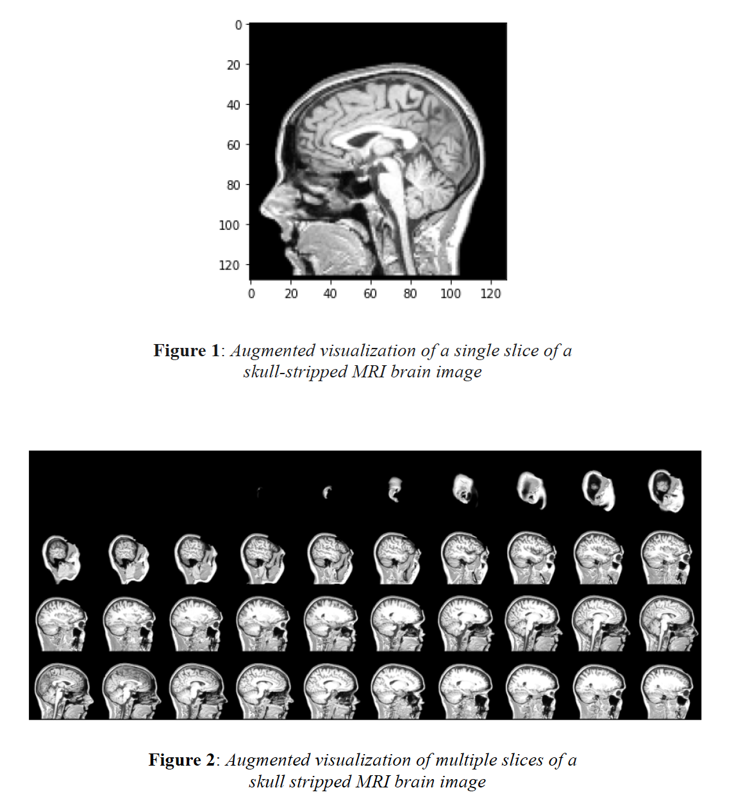
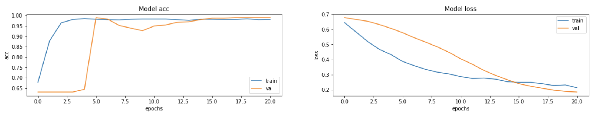
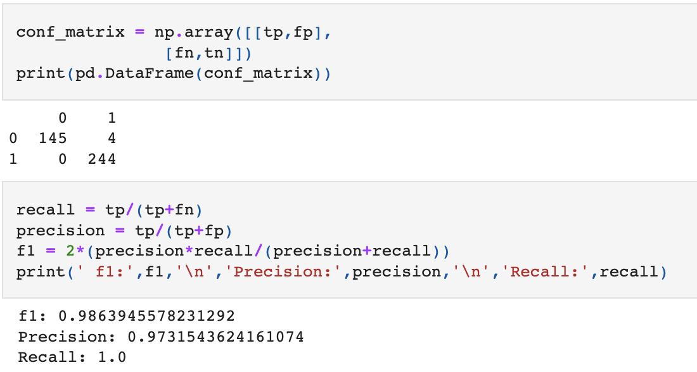

# Evaluation-of-skull-stripped-MRI-brain-images
Project requirement for CPSC 8650 - Data Mining 

Project consisted of developing a data mining tool to evaluate the quality of skull-stripped brain MRI images. The data mining tool has to satsisfy the following requirements:

- Determine whether facial features were removed to the extent that we could not recognize the individual anymore
- Determine whether brain voxels were removed resulting in the loss of important brain information

### About the data

- Total of 1311 NIFTI files of skull-stripped MRI brain images
- Skull-stripping was performed using BSE & BET algorithms
- Labels:
    + Recognizable-features: **Yes** - 692, **No** - 619
    + Brain-Loss_features: **Yes** - 604, **No** - 707

 ## Data Preprocess & Visualization
 
  [Data preprocessing](https://github.com/ckelaid/Evaluation-of-skull-stripped-MRI-brain-images/blob/main/data_preprocess_01.ipynb)
  
  
 
 ## Model fitting
 
 Two CNN models were fit for each task respectively
 
 #### Brain Loss Features Evaluation
 
 [Model fitting](https://github.com/ckelaid/Evaluation-of-skull-stripped-MRI-brain-images/blob/main/MODEL_32.ipynb)
 
   

   
 
 
 #### Recognizable Features Evaluation
 
 [Model fitting]()
 
